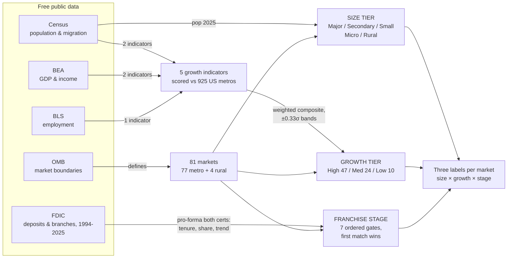

# Market Categorization Methodology

## Executive summary (plain English)

We gave every market the combined bank operates in — 77 metro areas and 4 rural
counties, 81 markets in all — three labels, each answering one plain question:

**How big is the market?** Size tier comes straight from official Census
population counts inside the federal government's market boundaries: Major Metro
(1M+ people, 16 markets), Secondary Metro (250k–1M, 30), Small Metro (19),
Micropolitan (12), and Rural county (4). One surprise: under the current federal
definitions, Birmingham counts as a Major Metro (1.20M people).

**Is it growing?** Growth tier blends five hard indicators — population growth,
net domestic migration, real GDP, jobs, and income per person — and compares each
market against *every* metro area in America, not just our own footprint. "High"
means growing faster than the nation. Result: 47 High, 24 Medium, 10 Low. The
Southeast skew is real — this region is where America is moving.

**Where are we on our journey in it?** Franchise stage uses 30 years of FDIC
branch and deposit records for both legacy banks (Pinnacle and Synovus), treated
as one combined history, and drops each market through seven ordered gates —
first match wins: Limited-Service Foothold (4), New Entrant (8), Entrenched
Leader consolidating (10), Pulling Back (3), Entrenched Leader (29), Expanding
(10), Established–Mature (17). Nashville anchors at 23.4% deposit share and
still gaining; Columbus GA holds 60.9%; the Expanding list is Charlotte, Raleigh,
Jacksonville and peers; the three Pulling Back markets (Miami, Naples, Savannah)
are all legacy-Synovus coastal positions.

Everything is built from five free public sources, every threshold is written
down, and every market's row prints the raw inputs behind its labels so a reader
can overrule any label by hand. Three cautions before quoting numbers externally:
deposit shares are "share where we operate," not full-metro shares; large
corporate deposit books sometimes move between offices on paper (the Columbus→
Atlanta relocation is flagged on the affected rows); and labels within ~2 points
of a cutoff are screening labels, not verdicts.

### Framework at a glance

*A companion visual overview lives in `methodology_overview.html` — a
self-contained page with the full framework walk-through.*

**Note:** this summary section is maintained by hand; re-running
`market_categorizer.py` regenerates the sections below it — re-add or re-check
this block after a re-run.

---

Generated 2026-08-17 by `market_categorizer.py`. The scoring script
performs NO network calls; every input is a cached extract in `data/`.

## 1. Unit of analysis

One row per market:

* **CBSA markets** - each Metropolitan or Micropolitan Statistical Area (2023 OMB
  delineations, Sept-2023 vintage) in which the bank operates at least one office
  (see "What counts as a branch" below).
* **Rural county markets** - each footprint county that belongs to no CBSA;
  `market_type = 'Rural county'`.

The footprint is the bank's authoritative August-2026 FDIC office list
(429 offices), which already includes the offices added in the
January-2026 Synovus merger.

**What counts as a "branch".** The office file is a list of *FDIC offices*, not a
list of deposit-taking branches. By `SERVTYPE_DESC`, 379 of the
429 offices are FULL SERVICE (brick-and-mortar or retail) and
therefore take deposits and file a Summary of Deposits record; the other
50 are LIMITED SERVICE (30 loan production, 6 drive thru/detached facility, 6 messenger, 3 other office/branch, 2 administrative, 2 mobile/seasonal, 1 retail) and take no deposits. Every
market row reports all three counts - `pinnacle_offices`,
`pinnacle_full_service_branches`, `pinnacle_limited_service_offices` - and the
word "branch" in this document means a **full-service, deposit-taking** office.
A market is included if the bank operates at least one office of any type in it,
so presence is not the same thing as a deposit franchise: 4 market(s)
contain **no full-service branch at all** and are in the file purely on
limited-service presence (19100 Dallas-Fort Worth-Arlington, TX (2 office(s), Major Metro / High); 21780 Evansville, IN (1 office(s), Secondary Metro / Medium); 24780 Greenville, NC (1 office(s), Small Metro / Medium); 31080 Los Angeles-Long Beach-Anaheim, CA (1 office(s), Major Metro / Low)). Those rows carry
`no_full_service_office:limited_service_presence_only` in `data_flags` and
necessarily show 0 deposits; read their growth tier as "this is a market the bank
has a foothold in", not "this is a deposit market the bank competes in".

Offices are mapped to markets by county FIPS through the 2023 CBSA crosswalk
(`data/cbsa_crosswalk.csv`), not by the CBSA field on the office record - the
office file carries stale delineations for 5 offices. Three of them (DORA BRANCH,
JASPER BRANCH and MEDICAL CENTER BRANCH, all in Walker County AL, STCNTY 01127)
are coded in the file to CBSA_NO 27530 "Jasper, AL", the micropolitan area that
the 2023 delineations retired when Walker County was added to CBSA 13820
Birmingham, AL; the crosswalk therefore books them to 13820. The other two are
MANNING BRANCH (Clarendon County SC, coded 44940 Sumter, SC -> non-CBSA rural
under the 2023 delineations) and CAMDEN FINANCIAL BANKING CENTER BRANCH (Camden
County GA, coded 41220 St. Marys, GA -> 28680 Kingsland, GA). All five overrides
are recorded in the `flags` column of `data/footprint.csv`.

Total markets: **81** (16 Major Metro,
30 Secondary Metro, 19 Small Metro,
12 Micropolitan, 4 Rural county).

## 2. Sources, vintages, pull date

All data pulled 2026-08-16 and cached under `data/` and `raw/`.

| Input | Source | Vintage / series | URL |
|---|---|---|---|
| Population, domestic + net migration, births, deaths | Census Bureau Population Estimates Program | Vintage 2025 (`cbsa-est2025-alldata.csv`, `co-est2025-alldata.csv`); 2020 base and 2025 estimate; migration components cumulated over estimate years 2021-2025 | https://www2.census.gov/programs-surveys/popest/datasets/2020-2025/metro/totals/ and .../counties/totals/ |
| Real GDP by county | BEA Regional, table CAGDP9 (real GDP, chained 2017 dollars) | 2019-2024, released Dec-2025 | https://apps.bea.gov/api/data (LineCode=1, GeoFips=COUNTY) |
| Personal income / population for PCPI | BEA Regional, table CAINC1 (LineCode 1 = personal income, 2 = population) | 2019-2024 | https://apps.bea.gov/api/data |
| Employment | BLS Quarterly Census of Employment and Wages, annual averages, all ownerships, total covered (`own_code=0`, `industry_code=10`) | 2019 and 2024 | https://data.bls.gov/cew/data/api/{year}/a/area/{area}.csv |
| Deposits | FDIC Summary of Deposits, certs 35583 (Pinnacle Bank) and 873 (Synovus Bank) | June-30 2020 and June-30 2025 | https://banks.data.fdic.gov/api/sod |
| CBSA delineations | OMB / Census delineation file `list1_2023.xlsx` | July 2023 | https://www2.census.gov/programs-surveys/metro-micro/geographies/reference-files/2023/delineation-files/ |

**BEA has no MSA-level GDP or per-capita-income table.** BEA Regional retired the
MAGDP*/MAINC* tables, and `GeoFips=MSA|MIC` is rejected by CAGDP9/CAINC1. MSA and
micropolitan GDP and PCPI were therefore **built by county aggregation** over the
2023 crosswalk: GDP = sum of county real GDP (an additive approximation to
chained dollars); PCPI = sum(county personal income) x 1000 / sum(county BEA
population), i.e. a true population-weighted rate, not a mean of county rates.
BEA merges 53 census counties/independent cities into 24 combination FIPS
(e.g. 51919 Fairfax + Fairfax City + Falls Church); these were resolved by name
(`data/_bea_combo_map.json`) so that **in the CBSA aggregation** no county is
dropped or double-counted. The combo map is applied only on that aggregation
path; the county-level benchmark distribution merges BEA on raw census FIPS and
does drop those counties - see section 5.

## 3. Size tier (Census Vintage-2025 population)

| Tier | Rule |
|---|---|
| Major Metro | Metropolitan Statistical Area, pop2025 >= 1,000,000 |
| Secondary Metro | Metropolitan Statistical Area, 250,000 - 999,999 |
| Small Metro | Metropolitan Statistical Area, pop2025 < 250,000 |
| Micropolitan | Micropolitan Statistical Area (any population) |
| Rural | non-CBSA county |

## 4. Growth indicators

1. **pop_cagr** = (pop2025 / pop2020)^(1/5) - 1. Census PEP Vintage 2025.
2. **netmig_rate** = cumulative net DOMESTIC migration 2021-2025 / pop2020.
   Domestic only, so it measures where Americans are moving between US areas and
   is not contaminated by the post-2021 surge in international arrivals. (At the
   national level domestic migration nets to zero by construction, so the US
   reference row uses NET migration, 2.51%, and is shown for
   context only - it is not the centering constant for any z-score.)
3. **gdp_cagr** = (real GDP 2024 / real GDP 2019)^(1/5) - 1, chained 2017 dollars.
4. **emp_cagr** = (QCEW annual-average employment 2024 / 2019)^(1/5) - 1.
5. **pcpi_cagr** = (PCPI 2024 / PCPI 2019)^(1/5) - 1. **Nominal** dollars: BEA
   publishes no county/MSA price deflator. Because every area is scored against
   the same national cross-section over the same window, the common inflation
   component is absorbed by the mean of the distribution and drops out of the
   z-score. Only the *relative* income trajectory survives, which is what the
   composite is meant to capture. The level of pcpi_cagr should not be read as
   real income growth.

US reference CAGRs: population 0.61%, real GDP 2.43%,
PCPI (nominal) 5.67%, QCEW employment 0.91%.

## 5. Standardization

For each indicator the benchmark distribution is computed across **all 925 US
metropolitan + micropolitan CBSAs**, unweighted (every CBSA counts once, so
Nashville and Aberdeen SD carry equal weight in defining "normal"). The
distribution is winsorized at the 1st and 99th percentiles, and the mean and
population standard deviation of the *winsorized* series are used as the
centering and scaling constants:

    z_i(area) = (x_i(area) - mean_w,i) / std_w,i

The area's own value is not clipped, so a genuine outlier keeps its extreme
z-score; winsorizing only prevents a handful of extremes from setting the scale.

Rural-county markets are scored against the **all-US-county** distribution, built
the same way. A rural county is therefore judged against counties, not against
metros. The county universe has 3,144 rows and the benchmark n
actually used is **3,144 counties for population,
3,144 for net migration, 3,080 for GDP and
3,080 for PCPI** (these are the `n_areas` values on the
`National_Benchmarks` sheet). The 64 counties missing
a GDP/PCPI growth rate are dropped from those two moments, and they are dropped
for identifiable reasons, not silently:

* 51 Virginia counties and independent cities that BEA publishes only inside a
  combination FIPS (51919 etc.). `_bea_combo_map.json` resolves those on the CBSA
  aggregation path but is **not** applied here, so they merge to nothing on raw
  census FIPS. 2 Hawaii counties (Kalawao, Maui) drop for the same reason.
* 9 Connecticut planning regions, whose 2019 GDP is 0 in the BEA extract because
  of the CT county/planning-region break (see Limitations).
* 2 Alaska census areas (Chugach, Copper River) created by the 2019 split of the
  former Valdez-Cordova Census Area, which have no 2019 BEA value.

None of these are footprint markets, and the effect on the moments is
second-order, but the county GDP/PCPI benchmark is a
3,080-county distribution and should be cited as such. Note also
that the row counts of the BEA source files (3,144-row county
universe vs. differing BEA file lengths) are *not* the benchmark n; only the
`n_areas` column is.

**emp_cagr limitation.** QCEW was pulled only for footprint areas, so no national
CBSA distribution exists for employment. Its z-score uses the US total-covered
employment CAGR as the center and the winsorized standard deviation of the
81 footprint areas as the scale:

    z_emp = (emp_cagr(area) - 0.009130) / 0.015205

The footprint is a Southeast-weighted, faster-growing sample than the nation, so
this spread is narrower than a true national CBSA spread would be, which slightly
*inflates* the magnitude of z_emp. emp_cagr carries only a 10% weight partly for
this reason, and rural counties use the same construction.

## 6. Composite and growth tier

    composite_z = 0.225*z_pop + 0.225*z_netmig + 0.225*z_gdp + 0.225*z_pcpi + 0.10*z_emp

The four nationally benchmarked indicators split 90% evenly; employment takes the
remaining 10% because of the weaker benchmark above. When an indicator is missing
for a market, its weight is dropped and the remaining weights are renormalized to
sum to 1; the renormalization is recorded in `data_flags`.

| Growth tier | Rule |
|---|---|
| High | composite_z >= +0.33 |
| Medium | -0.33 < composite_z < +0.33 |
| Low | composite_z <= -0.33 |

+/-0.33 sigma is a deliberately modest cut: on a normal distribution it puts
roughly the top 37% in High and the bottom 37% in Low, so "Medium" means
genuinely middle-of-the-pack rather than merely un-extreme. Result:
47 High, 24 Medium, 10 Low.

## 7. Merger branches and deposit matching

`branches_acquired_2026` counts offices that entered the footprint through the
January-2026 Synovus acquisition (250 of 429 offices). Those offices are
included in every market's branch and deposit totals: the question this engine
answers is "how attractive is the market the combined bank now sits in", not
"where did the branch come from".

Deposits are matched office-to-office on FDIC UNINUM against the June-2025 and
June-2020 SOD files for both certs. 377 of
429 offices match a 2025 SOD record; 52 do not and
carry `no_sod2025_match` in `data/footprint.csv`. The dominant reason is **office
type, not timing**: 40 of the 52 are
limited-service offices (loan production, messenger, retail, other) that take no
deposits and never file an SOD record at all. Only 12 are
full-service, and those 12 are exactly the offices established
after the June-30-2025 survey date - the timing explanation covers
12 of the 52, no more. 29 of
the unmatched offices have in fact been open since before 2020. Unmatched offices
contribute 0 to their market's deposit total, so `office_file_deposits_2025_kusd` is
a **lower bound** wherever `pinnacle_limited_service_offices` is non-zero, and is
0 by construction in the markets flagged
`no_full_service_office:limited_service_presence_only`. Separately, 13 June-2025
SOD records for these certs match no office in the August-2026 file (branches
closed or divested between the survey and the file date); their deposits are
excluded from every market total.

**Two deposit columns, two different bases - read the header.** The sheet carries
`office_file_deposits_2025_kusd` (section 1 basis: the June-2025 DEPSUMBR of the
offices present in the **August-2026 office file**, so an office that closed
between the survey and the file date, or that the file cannot match, contributes
nothing) and `proforma_deposits_2025_kusd` (section 8 basis: **every** June-2025
SOD record filed by certs 35583 and 873 in the market's counties). They are not
interchangeable and they do not tie: column totals are
**$95,314,408k vs $96,024,828k, a $710,420k gap**, concentrated in
6 markets. The largest single case is **Bowling Green KY (14540): $0 against
$172,876k** - both Bowling Green offices in the file carry `no_sod2025_match` (one
is an LPO, the other was established 25-Aug-2025, after the survey), while the SOD
itself holds one cert-35583 office with $172,876k in Warren County. The other
divergences are Charlotte-Concord-Gastonia, NC-SC -252,503k; Charleston-North Charleston, SC -165,921k; Huntsville, AL -72,714k; Greenville-Anderson-Greer, SC -46,318k; Roanoke, VA -88k. Every franchise metric in section 8 -
share, BEI, share delta - uses the **pro-forma** column; the office-file column is
retained only because sections 1-7 are built on the office file and it is the
figure that reconciles to `pinnacle_offices`. It was previously named
`pinnacle_deposits_2025_kusd`, which invited exactly the comparison it fails.

`deposit_growth_context` is deliberately a *context string*, not a scored
indicator: it reports the same-branch 2020->2025 deposit CAGR computed over
branches that report **positive deposits at both endpoints**, plus the count of
branches with no 2020 record. Branch-level deposits are booked to the branch of
record and shift with internal reallocations: 2 office(s) nationwide
report deposits in June-2020 and a literal $0 in June-2025 (Nashville's main
office, UNINUM 82012, $8,269,186k -> $0, and Albany GA's Five Points branch,
UNINUM 250567, $32,440k -> $0). Those books moved to another office of record; the
deposits were not lost.

**The endpoint rule is now symmetric on both sides of the move, which it was not
before.** Dropping the SOURCE office from the 2020 base while leaving the
RECIPIENT office in the 2025 numerator is not a same-branch comparison - it is a
one-sided one, and it inflated rather than corrected the figure. Nashville printed
a "same-branch CAGR" of **32.4%** because UNINUM 82012's $8.27bn was removed from
the 2020 base while NASHVILLE YARDS (UNINUM 465213, $42,947k -> $13,659,117k), the
office that received the book, stayed in the 2025 numerator. The rule now **pairs**
the two: when an office in the same market shows an absolute increase at least as
large as the whole vanished book, the source's 2020 balance is netted back into
the base, so source and recipient are compared as a single continuing unit and
nothing is discarded. Nashville falls to **8.5%** and Albany GA from 3.8% to
**1.6%**; the pairing is named inline in the context string. Where no office in the
market absorbed a matching amount, the book left the market and the string says so
explicitly instead of implying the problem was handled. This is also why deposit
growth is not reliable enough to enter the composite.

## 8. Limitations

* **Chained-dollar additivity.** Summing county chained-2017-dollar GDP to CBSA
  level is an approximation; BEA warns chained dollars are not strictly additive.
  The bias is second-order over a 5-year window and affects all areas alike.
* **Employment benchmark** - see section 5.
* **Nominal PCPI** - see section 4.
* **Connecticut geography break.** BEA reports old CT counties for 2019-2023 and
  planning regions for 2024, so 7 CT metros have no computable 2019-2024 GDP/PCPI
  growth and are NULL in the national distribution (they are excluded from the
  moments, not zero-filled). No footprint market is affected.
* **Puerto Rico** is absent from the Census and BEA extracts, so the national
  universe is the 50 states + DC. No footprint market is affected.
* **CBSA delineation drift.** The office file's own CBSA fields are pre-2023 in
  places (see section 1): the three Walker County AL offices are still coded to
  27530 "Jasper, AL", the micropolitan area the 2023 delineations dissolved into
  Birmingham. The 2023 vintage also retired the "Birmingham-Hoover" title, so the
  market is now CBSA 13820 "Birmingham, AL" with a Vintage-2025 population of
  1,197,766, i.e. above the 1,000,000 Major Metro threshold. Anyone expecting a
  "Secondary Metro" label for Birmingham is working from a pre-2023 delineation
  or a divisional population.
* **Single-vintage endpoints.** All CAGRs use two endpoints; a COVID-distorted
  2020 or 2019 base is not smoothed. 2019->2024 was chosen for the economic
  series precisely to bracket rather than start inside the pandemic.
* **QCEW micro coverage.** Micropolitan CBSAs resolve at QCEW aggregation level
  80, not 40. Kingsland GA (28680) had no 2019 micro-area file; it is a
  single-county area (Camden County GA) whose 2024 micro total equals the county
  total exactly, so 2019 was backfilled from county 13039.

## 8. Franchise stage -- "where is newco on its journey in this market?"

Sections 1-7 describe the MARKET. This section describes the BANK'S POSITION in
that market. It is a separate dimension: a Low-growth market can be an Entrenched
Leader franchise and a High-growth market can be a two-branch New Entrant.

### 8.1 Sources

| Input | File | Content |
|---|---|---|
| Pro-forma branch/deposit history | `data/sod_history.csv` | FDIC SOD, certs **35583** (legacy Pinnacle Bank) and **873** (Synovus Bank), every survey year **1994-2025**, aggregated to cert-year-county (2,134 rows). |
| All-institution market denominator | `data/sod_market_county.csv` | FDIC SOD county totals for **every institution**, June-2020 and June-2025, for the 151 footprint counties: `market_deposits_kusd`, `market_branches`, `n_institutions` (302 county-year rows). |
| Top-5 competitor detail | `data/sod_market_detail_top.csv` | Per county-year, the five largest certs by deposits (1,488 rows; 14 county-years have fewer than five certs). Context only -- not an input to any stage rule. |
| Current office file | `data/footprint.csv` | 429 offices with `acquired_2026` provenance and `SERVTYPE` full/limited-service split. |

### 8.2 Pro-forma treatment

Certs 35583 and 873 are **summed in every year**. The January-2026 merger means the
combined company's history in a market is the **earlier** of the two predecessors'
histories: Columbus GA is not a 2026 entry for newco, it is a 30-year franchise
that newco now owns. No back-adjustment, no pro-rating -- a simple union of the
two charters' SOD footprints.

**Geography.** Counties map to the same 81 markets used above (77 CBSAs via the
2023 crosswalk + 4 non-CBSA rural counties). Two maps are used, deliberately:

* **Strict (deposit-taking footprint counties)** for every **deposit figure and
  share**. Numerator and denominator cover the same counties in the same year, so a
  share is a true within-market share -- of the counties the bank actually operates
  in, not of the full CBSA.
* **Wide (footprint counties + any other county of the same CBSA)** for
  `entry_year` **and for the bank's own branch counts**. A branch count is a
  bank-side census, not a ratio, so it must cover the whole CBSA.

**Correction applied in this run (branch counts).** The strict map was previously
used for `branches_2020` as well. Three markets held an office in 2020 in a CBSA
county they have since exited, so their 2020 count was understated by one and
`net_branch_change_5yr` overstated by +1:

| Market | Wide-only county | 2020 branches / deposits | Effect |
|---|---|---|---|
| 36740 Orlando-Kissimmee-Sanford FL | 12069 Lake FL | 1 / $16,849k | net +1 -> **0**; the market no longer qualifies as 'Expanding' |
| 45300 Tampa-St. Petersburg-Clearwater FL | 12053 Hernando FL | 1 / $81,880k | net -1 -> -2; label unchanged |
| 24860 Greenville-Anderson-Greer SC | 45007 Anderson SC | 1 / $27,251k | net 0 -> -1; label unchanged |

Orlando's 'Expanding' label rested solely on the young-market clause
(tenure < 12 AND bps > 0 AND net > 0); with the true 2020
count that clause fails. The three markets carry
`branches_2020_includes_cbsa_county_since_exited` in `data_flags`. **No 2025 SOD
branch sits in a wide-only county**, so `branches_2025_sod` is identical on both
maps and `branch_share_2025` stays numerator/denominator consistent.

**Correction applied in this run (LPO-only counties in the denominator).** The
denominator was previously summed over every footprint county, including counties
whose only presence is a loan-production or limited-service office. An LPO cannot
file a Summary of Deposits, so those counties contributed a structurally **zero
numerator against a full denominator** and diluted the share. Nine counties are
LPO-only; five constitute their whole market (those are 'Limited-Service Foothold'
and now report a **null**, not a zero, share). Four sat inside full-service markets:

| Market | LPO-only county | Share of old denominator | deposit_share_2025 old -> new |
|---|---|---|---|
| 31340 Lynchburg VA | 51680 Lynchburg city | 54.5% | 2.115% -> 4.644% |
| 40220 Roanoke VA | 51067 Franklin | 15.2% | 11.278% -> 13.299% |
| 32820 Memphis TN-MS-AR | 28033 DeSoto MS, 47167 Tipton TN | 14.9% | 6.605% -> 7.758% |
| 16740 Charlotte NC-SC | 45091 York SC | 1.0% | 0.422% -> 0.426% |

Pro-forma deposits in all nine counties are $0 in both endpoint years (verified in
`sod_history.csv`), so nothing leaves the numerator and the share stays consistent
-- it is now taken over the counties where a share is definable at all. No stage
label flips: Memphis at 7.76% still sits below the 8% cutoff.

**Pre-2010 cert-873 caveat.** Before 2010 cert 873 is only the legacy Columbus Bank
& Trust charter (18-37 branches in 2-5 Georgia counties); the rest of Synovus sat
under ~30 sibling certs that consolidated into 873 in 2010 (19 -> 325 branches,
2 -> 98 counties). Pre-2010 pro-forma branch counts are therefore a **floor**, and
`entry_year` for legacy-Synovus markets is a **latest-possible** entry date -- the
true franchise is at least as old, never younger.

The bias therefore runs toward **short** tenure, and short tenure is exactly what
feeds the New Entrant clause (tenure < 8) and the young-market
Expanding clause (tenure < 12). (An earlier draft of this
note asserted the opposite -- that "nothing in the stage rules rewards an early
entry_year, so the bias is conservative" -- which is backwards.) What actually
protects the labels is the 2010 consolidation floor: the earliest spurious
`entry_year` any legacy-Synovus market can take is **2010**, giving tenure 15,
which clears both gates with room. No market is mislabelled by this, but the
reason is the 2010 floor, not the direction of the bias.

**`entry_year` can be discontinuous.** It is a `min` over survey years, so a
missing mid-year cannot reset tenure -- but `tenure_years` is elapsed-since-first-
presence, **not continuous presence**, and the pro-forma union can date a market to
a predecessor that has since left it. Three markets have interior gaps: Atlanta
12060 (absent 2000-2009), Macon 31420 (2014-2018) and Memphis 32820 (2014-2015).
Memphis is the substantive one: cert 873 ran 9 Memphis branches in 2010 falling to
6 by 2013 and then exited; cert 35583 first appears in 2016. The row reads
"entered 2010, tenure 15" when neither charter had a Memphis branch in 2014-2015
and the current franchise is Pinnacle's from 2016 (true continuous tenure 9). No
stage flips -- tenure 15 clears both the <8 and
<12 gates either way -- but read `entry_year` as
first-ever-presence, not as an unbroken franchise age.

### 8.3 Metric definitions

| Column | Definition |
|---|---|
| `entry_year` | Earliest SOD year (1994-2025) in which either cert reported >=1 branch in the market (wide county map). |
| `tenure_years` | 2025 - `entry_year`. |
| `branches_2020`, `branches_2025_sod` | Pro-forma count of **deposit-reporting SOD offices** (both certs), **wide** county map (whole CBSA). These differ from `pinnacle_offices` in section 1, which counts the Aug-2026 office file including limited-service offices, and `branches_2020` also differs from a strict-map count in the three markets tabled in 8.2. |
| `office_file_deposits_2025_kusd` vs `proforma_deposits_2025_kusd` | **Different bases; they do not tie.** The first is the office-file basis used by sections 1-7, the second the SOD basis used by every metric in this section. See section 7 for the reconciliation and the Bowling Green $0-vs-$172,876k case. Nothing in section 8 uses the office-file column. |
| `book_moved_out_kusd`, `book_moved_in_kusd` | Gross office-level book relocation detected between the endpoint surveys (section 8.6). Diagnostic only -- no stage rule reads them -- but a non-zero value means the share move behind the label is partly a booking change. |
| `branches_2020_wide_only` | Non-empty when `branches_2020` includes an office in a CBSA county the bank has since exited (8.2). |
| `net_branch_change_5yr` | `branches_2025_sod` - `branches_2020`. |
| `branch_change_pct` | `branches_2025_sod` / `branches_2020` - 1; null when `branches_2020` = 0. |
| `deposit_share_2025` | pro-forma deposits / all-institution `market_deposits_kusd`, June-2025, same counties. `deposit_share_2020` likewise. |
| `share_delta_5yr_bps` | (`deposit_share_2025` - `deposit_share_2020`) x 10,000. |
| `branch_share_2025` | `branches_2025_sod` / all-institution `market_branches` (2025). |
| `branch_effectiveness_index` (BEI) | `deposit_share_2025` / `branch_share_2025`; null when branch share is 0. **BEI > 1** = the franchise gathers more deposit share than its physical footprint would imply; **BEI < 1** = an execution or vintage gap. |
| `entered_via_2026_merger` | True when **all** current full-service branches in the market carry `acquired_2026 = True` (for the limited-service-only markets, all offices). |
| `n_institutions` | June-2025 distinct-cert count from the county file. For multi-county markets this is a **sum of per-county counts**, so a bank present in two counties of one market is counted twice; read it as competitive density ("institution-county presences"), not a distinct bank count. |

### 8.4 Stage rules (deterministic, ordered, first match wins)

| Order | Stage | Rule | Markets |
|---|---|---|---|
| 1 | **Limited-Service Foothold** | Zero FULL-SERVICE branches today: presence is a loan-production / limited-service office only, so the bank files no Summary of Deposits record and holds no measurable deposit share. Checked first because every deposit-based rule below is undefined here. | 4 |
| 2 | **New Entrant** | entry_year >= 2021 (first pro-forma SOD branch in the last 5 surveys) OR (tenure < 8 yrs AND branches_2025 <= 2 AND deposit_share_2025 < 2%). Young and sub-scale. A market with at least one full-service branch today but NO SOD history at all is also a New Entrant: the office was established after the June-2025 survey date and has not yet filed a Summary of Deposits (e.g. Decatur AL, opened 27-Jan-2026). | 8 |
| 3 | **Entrenched Leader (consolidating)** | BOTH tests fire: deposit_share_2025 >= 8% AND the Pulling-Back branch/share test (rule 4). Evaluated BEFORE plain Pulling Back and plain Entrenched Leader, so a dominant franchise thinning overlapping branches is never mislabelled as a retreat. | 10 |
| 4 | **Pulling Back** | net_branch_change_5yr <= -2 AND share_delta_5yr_bps < 0; OR branch_change_pct <= -25% with a measured non-positive share delta (share_delta_5yr_bps <= 0). Physical and share retreat together. | 3 |
| 5 | **Entrenched Leader** | deposit_share_2025 >= 8%. A market where the bank is a structural incumbent. | 29 |
| 6 | **Expanding** | net_branch_change_5yr >= +2 OR share_delta_5yr_bps >= +50 OR (tenure < 12 yrs AND share_delta_5yr_bps > 0 AND branches grew). | 10 |
| 7 | **Established - Mature** | Everything else: long presence, share and branch count broadly stable, below the entrenchment cutoff. | 17 |

The table above is printed in **true evaluation order**. (An earlier draft listed
'Entrenched Leader (consolidating)' as a trailing variant *below* the
'Everything else' catch-all, in a table whose entire premise is order.)

**Borderline convention.** Rules are evaluated strictly in order and the first
match wins; no market can carry two stages. The one explicit collision is a market
that satisfies both the Pulling-Back test and the >= 8%
entrenchment test. Those are labelled **'Entrenched Leader (consolidating)'**
rather than 'Pulling Back'. The 10 market(s) that hit this collision in
this run: Columbus, GA-AL (share 60.9%, -1248bps, -2 branches); Athens-Clarke County, GA (share 24.3%, -351bps, -2 branches); Valdosta, GA (share 17.8%, -639bps, -1 branches); Tuscaloosa, AL (share 12.2%, -40bps, -2 branches); Tifton, GA (share 31.3%, -291bps, -1 branches); Sumter, SC (share 32.9%, -340bps, -1 branches); Albany, GA (share 13.2%, -283bps, -1 branches); Calhoun, GA (share 31.5%, -424bps, -1 branches); Thomasville, GA (share 14.5%, -432bps, -1 branches); Rome, GA (share 11.9%, -698bps, -1 branches).

**Do not read 'consolidating' as a uniform story.** In most of these markets the
share slipped while a dominant franchise thinned overlapping branches. In at least
one it did not: **Columbus GA-AL (17980)** carries the largest share fall in the
set (-1247.7bps) not because two branches closed but because the Synovus corporate
book of record moved out of the market -- see 8.6. Its `stage_detail` and
`data_flags` say so on the row. The label is a rules output; the narrative behind
each one has to be read off the row, not assumed from the stage name.

**Pulling Back markets in this run:** Miami-Fort Lauderdale-West Palm Beach, FL (Pulling Back; share 0.9% (-63bps 5yr); 18 branches (-3 5yr); entered 2019; via 2026 merger; CAUTION: $1.0bn booked IN to offices here between the 2020 and 2025 surveys (office-level book relocation, see methodology 8.6) -- check whether the move was intra-market (share unaffected) or cross-market (share delta is partly a booking change, not an operating result) before reading this label); Naples-Marco Island, FL (Pulling Back; share 3.0% (-79bps 5yr); 3 branches (-1 5yr); entered 2010; via 2026 merger); Savannah, GA (Pulling Back; share 5.7% (-88bps 5yr); 3 branches (-1 5yr); entered 2010; via 2026 merger).

**Fragile labels.** Two markets sit on a knife edge and should be read with the
inputs, not the label:

* **Naples-Marco Island FL** is 'Pulling Back' on a branch change of *exactly*
  -25.0% (4 -> 3 branches), which passes only because the
  test is inclusive; `net_branch_change_5yr` = -1 fails the primary clause. Its
  supporting share fall rests on a deposit decline that the run's own
  `deposit_book_drop_*` flag says needs investigating. One branch, or one resolved
  booking question, moves it to 'Established - Mature'.
* **Orlando FL** was 'Expanding' before the 8.2 branch-count correction and is
  'Established - Mature' after it, on a single 2020 branch in Lake County.

### 8.5 The 8% entrenchment convention -- provenance

**The 8% cutoff is an in-house analyst convention. It is not sourced, and this
document no longer claims that it is.**

An earlier draft attributed a set of highly specific, checkable claims -- "plotted
deposit share against branch share across 250+ US counties", "an S-shaped
relationship in more than 80% of markets", "critical mass typically begins around
6-8% branch share" -- to McKinsey, *The Future of Retail Banking*, 2010, chapter
"Big Fish in Small Ponds", with **no URL, no page, no exhibit number and no
corresponding source file anywhere in this repository**. Nothing in `data/` or in
the fetch scripts supports those figures; they existed only as hardcoded prose in
`market_categorizer.py`. A parallel claim that JPMorgan targets "roughly 10%
**branch** share" in expansion markets was equally uncited, and JPMorgan's public
expansion-market statements are normally framed in **deposit** share -- so that
sentence may well have carried the very units error the text elsewhere warns
against. All of it has been removed rather than dressed up.

What survives is the reasoning, which stands on its own and does not need a
citation:

* Local deposit markets exhibit scale effects. Below some level of local presence
  a bank is a price-taker on deposits and cannot amortise local marketing,
  staffing and commercial-banking coverage; above it, share tends to compound.
  That much is uncontroversial; **where the inflection sits is market-specific and
  is not estimated here**.
* 8% is chosen as a **legible screening line**, not an estimate of that
  inflection. It answers "is this a market where we are structurally significant?"
  with a round number a reader can re-cut.
* The units caveat is real and is the reason `branch_effectiveness_index` is on
  every row: our cutoff is on **deposit** share, and BEI = deposit share / branch
  share is the bridge to any branch-share-based reference a reader wants to bring.
* Any such literature would predate mobile-first deposit gathering, digital-only
  competitors and branch-network thinning, all of which weaken the branch-share ->
  deposit-share link.

**Sensitivity to the cutoff.** Because the number is a convention, here is what
moving it does. Markets at or above the cutoff:

| Cutoff | Markets | Share of the 81-market book |
|---|---|---|
| 6% | 43 | 53% |
| **8% (used)** | **39** | **48%** |
| 10% | 34 | 42% |

9 markets -- 11% of the book -- change side on
a +/-2pt move. Markets within 2 points of the line, i.e. the ones a reader should
sanity-check by hand: Charleston-North Charleston, SC 9.4%; Brunswick-St. Simons, GA 9.1%; Dalton, GA 8.4%; Winston-Salem, NC 8.4%; Birmingham, AL 8.3%; Memphis, TN-MS-AR 7.8%; Myrtle Beach-Conway-North Myrtle Beach, SC 7.3%; Atlanta-Sandy Springs-Roswell, GA 6.5%; Columbia, SC 6.1%.

### 8.6 Known data wart -- main-office deposit reallocation

Deposits in the SOD are assigned to the **branch of record**, and banks periodically
move a book between offices. Cert 35583's Nashville main office (UNINUM 82012)
reported **DEPSUMBR = $0** in June-2025 after reporting $8.27bn in June-2020.

**Share levels keep SOD as-reported** -- the money did not leave the bank, and if it
moved to another office in the same county the market share is unaffected. This run
therefore *checks where the book sits* rather than assuming:

* Cert 35583, Davidson County TN (47037): **$10,452,141k across
  10 branches in 2020 -> $15,440,535k across
  13 branches in 2025** (+47.7%). The
  county book **grew, so the reallocation stayed inside Davidson County and the Nashville MSA share is NOT distorted**.
  Nashville MSA pro-forma position on this run: pro-forma $21.6bn of a $92.3bn market = 23.4% deposit share, 38 branches, consistent with the
  bank's ~$21bn Nashville franchise once the offices outside Davidson County are
  included.
* Five Points branch (UNINUM 250567, cert 873, county
  13095): 2025 SOD reports $0;
  the county-level cert-873 book went $110,159k ->
  $147,504k, i.e. the book
  stayed inside the county and the market share is unaffected.

### 8.6b The Columbus GA -> Atlanta corporate-book relocation

The Nashville case above is an **intra-county** move: it changes which office
reports the money, not which market. Between the 2020 and 2021 surveys the same
thing happened **across markets**, and the previous version of this document did
not detect it, name it, or flag it.

Market-level pro-forma deposits:

| Market | 2020 | 2021 | 2025 |
|---|---|---|---|
| 17980 Columbus GA-AL | $8,959,045k | $4,914,458k | $5,699,765k |
| 12060 Atlanta GA | $6,685,981k | $10,868,774k | $15,331,595k |

Office level (`data/sod_history_office.csv`), cert 873:

| UNINUM | Office | Market | 2020 | 2021 | 2025 |
|---|---|---|---|---|---|
| 556 | Synovus main office, Columbus | 17980 | $7,672,011k | $3,431,780k | $0 |
| 672980 | replacement Columbus office of record | 17980 | -- | -- | $4,221,214k |
| 591421 | OVERTON BRANCH (Cobb Cty GA) | 12060 | $633,543k | $3,753,597k | $7,888,503k |

Synovus moved its corporate book of record out of Columbus. Roughly $4.2bn of it
re-appears at a replacement Columbus office; the Overton office in metro Atlanta
picks up **+$7.25bn** over the five years, against a starting balance of $634m.
This is a booking event, not a customer migration 100 miles up the interstate.

**Consequences for two headline labels, stated plainly:**

* **Columbus is 'Entrenched Leader (consolidating)'** on
  `share_delta_5yr_bps` = -1247.7bps, the largest share fall in the book. The
  'consolidating' story -- a dominant franchise pruning overlapping branches -- is
  the wrong explanation here. Two branches closed; the share fell because the book
  moved markets.
* **Atlanta is 'Expanding'** on the >= +50bps clause with
  +288.8bps, while **cert 873's own Atlanta branch count FELL 45 -> 41** over the
  same period as its Atlanta deposits went $6.66bn -> $14.27bn. (Pro-forma
  `branches_2025_sod` rises to 47 only because legacy Pinnacle added 5 offices.)
  That is precisely the "market shows Expanding from a booking artifact" failure
  this section exists to prevent, and Columbus is its mirror image on the retreat
  side.

**What has changed in this run.** An office-level detector now runs over the two
endpoint surveys (2020 vs 2025). An office is reported as
a material book movement only when it is **both**

* material in dollars -- a move of at least
  **$1.0bn**, or at least
  **25% of its market's own 2020 book**
  subject to a $25m floor; **and**
* anomalous in its own terms -- a **source** kept
  <=20% of its own 2020 balance, a
  **recipient** ended at >=5x its own 2020
  balance (an office that did not exist in 2020 qualifies only on the
  absolute $1.0bn test).

The second condition is what separates a booking move from a large branch simply
growing: size alone is not evidence. Every affected market -- **source and
recipient alike** --
carries `book_relocation_out:` / `book_relocation_in:` in `data_flags` and a
`CAUTION:` clause appended to `stage_detail`, next to the label the movement drove.
Markets flagged in this run:

| Market | Stage | Book out | Book in | share_delta_5yr_bps |
|---|---|---|---|---|
| 34980 Nashville-Davidson--Murfreesboro--Franklin, TN | Entrenched Leader | $8.27bn | $15.26bn | +488.0 |
| 17980 Columbus, GA-AL | Entrenched Leader (consolidating) | $7.67bn | $4.22bn | -1247.7 |
| 37340 Palm Bay-Melbourne-Titusville, FL | New Entrant | $0.06bn | -- | -89.9 |
| 33660 Mobile, AL | Established - Mature | $0.04bn | -- | +10.0 |
| 33100 Miami-Fort Lauderdale-West Palm Beach, FL | Pulling Back | -- | $1.02bn | -63.2 |
| 12060 Atlanta-Sandy Springs-Roswell, GA | Expanding | -- | $7.25bn | +288.8 |
| 49180 Winston-Salem, NC | Entrenched Leader | -- | $0.45bn | -17.8 |
| 47900 Washington-Arlington-Alexandria, DC-VA-MD-WV | New Entrant | -- | $2.14bn | +112.2 |

The labels themselves are left as the rules produce them. The stage rules are a
deterministic screen, not a judgement (8.7); the fix for an artifact-driven label
is to make the artifact impossible to miss on the row, which is now the case.

### 8.6c The blanket deposit-drop flag

Any market whose pro-forma deposits fell more than
20% between the endpoint surveys is flagged
`deposit_book_drop_*:check_main_office_reallocation`.

**This test used to be switched off exactly where it was needed.** It previously
fired only when `net_branch_change_5yr > -2`, which exempted the two largest
pro-forma deposit collapses in the book -- **Columbus GA-AL** (deposits -36.4%,
net -2) and **Miami-Fort Lauderdale-West Palm Beach FL** (-29.4%, net -3) -- both
markets whose stage label is driven by the very deposit movement the flag exists
to question. The guard also inverted the logic: a bank that closes branches *and*
loses a third of its book is the least plausible case to exempt from a
booking-artifact check, not the most. The branch condition has been removed.
Markets flagged now: Columbus, GA-AL (-36%, net -2 branches, Entrenched Leader (consolidating)); Miami-Fort Lauderdale-West Palm Beach, FL (-29%, net -3 branches, Pulling Back); Naples-Marco Island, FL (-26%, net -1 branches, Pulling Back); North Port-Bradenton-Sarasota, FL (-37%, net +0 branches, Established - Mature); Rome, GA (-22%, net -1 branches, Entrenched Leader (consolidating)); Deltona-Daytona Beach-Ormond Beach, FL (-36%, net +0 branches, New Entrant); Palm Bay-Melbourne-Titusville, FL (-52%, net -1 branches, New Entrant); Sebastian-Vero Beach-West Vero Corridor, FL (-40%, net +0 branches, New Entrant); Daphne-Fairhope-Foley, AL (-44%, net +0 branches, Established - Mature).

### 8.7 Limitations of the franchise-stage dimension

* **Annual June snapshots.** The SOD is a single as-of-June-30 observation each
  year. Branches opened and closed inside a survey year are invisible, and a
  quarter-end balance-sheet position is not an average balance.
* **Deposits are assigned to the branch of record.** Commercial, brokered, trust
  and digital deposits are booked where the relationship sits, not where the
  customer is; large-corporate books concentrate at HQ. Section 8.6 names the
  Nashville (intra-county) and Columbus GA -> Atlanta (cross-market) cases, and an
  office-level detector now flags both sides of any move above the 8.6b threshold
  -- but the effect is general and continuous, and only the large discrete moves
  are detectable this way. It inflates every HQ market's share while deflating its
  neighbours'.
* **The 8% entrenchment line is a convention, not an estimate**, and it is not
  sourced to any literature (8.5). 9 of the 81 markets change
  side on a +/-2pt move.
* **Two kinds of zero share.** The four Limited-Service Foothold markets now
  report `deposit_share_2025` as **null**, not 0.0: an LPO cannot file an SOD, so
  the share is undefined and averaging or ranking the column no longer silently
  includes them. Decatur AL is different and is left as a **measured** 0.0% -- it
  has a full-service branch, opened 27-Jan-2026, and genuinely held no deposits at
  the June-2025 survey date. Its row carries
  `no_sod_history:entry_year_unavailable` and reads "entered n/a".
* **Same-county denominators.** Shares are computed over the counties the bank
  operates in, not the full CBSA. For a market where the bank sits in one county
  of a five-county metro, the share answers "share where we are", which is the
  right operating question but is NOT comparable to a published full-MSA share.
* **`entry_year` is a SOD-presence date**, not a charter or first-customer date,
  and for pre-2010 legacy-Synovus markets it is a latest-possible bound (8.2).
* **Stage is a rules-based label, not a judgement.** The thresholds are round
  numbers chosen for legibility; a market one branch either side of a cutoff can
  flip stage. `stage_detail` exposes every input on the row so a reader can
  overrule the label without re-running anything.
* **No competitor dynamics.** The rules use only the bank's own trajectory and its
  share of the market total; a share gain taken from a failing competitor and one
  taken from a healthy one look identical here.
